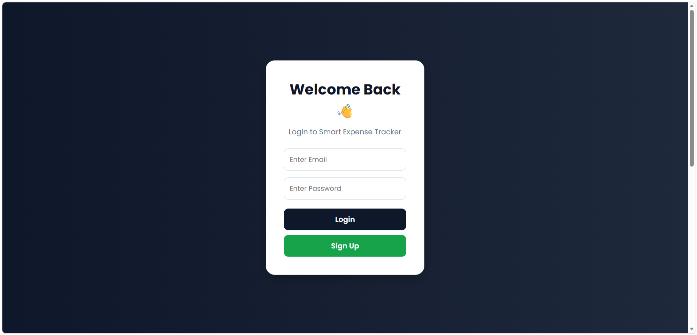
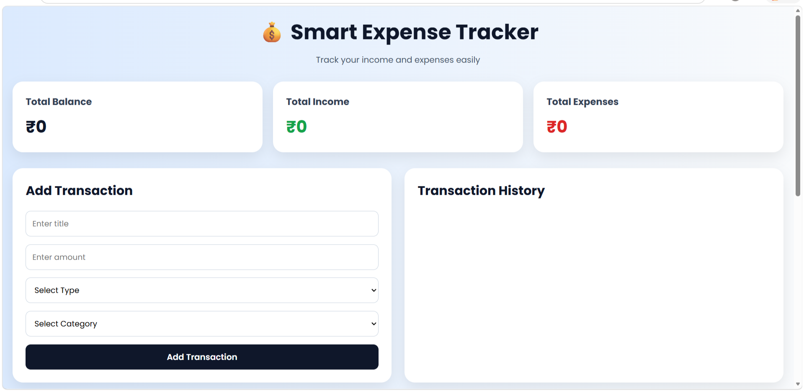
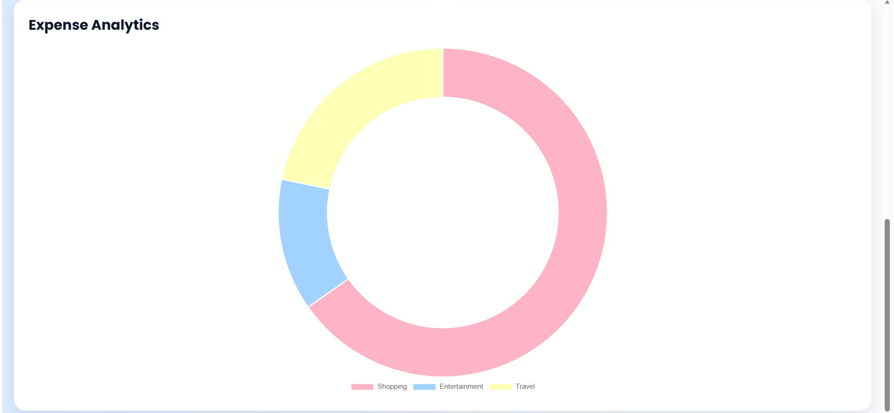
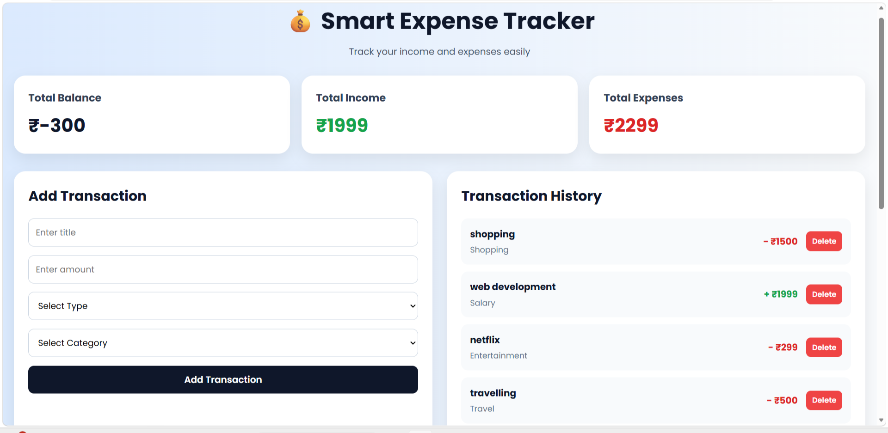

# Smart Expense Tracker

A modern and responsive web-based expense tracking application that helps users manage income and expenses efficiently with real-time analytics, Firebase authentication, and interactive charts.


## Overview

Smart Expense Tracker is a personal finance management application designed to simplify personal finance management, expense tracking, and budgeting. Users can securely log in, add transactions, categorize expenses, and analyze spending habits using graphical insights.

The application uses Firebase Authentication for user login/signup and Firestore Database for storing transaction data securely.


## Features

### Authentication System

* User Signup
* User Login
* Secure Firebase Authentication

### Expense Management

* Add Income & Expenses
* Categorize Transactions
* Real-time Balance Calculation
* Expense History Tracking

### Analytics Dashboard

* Interactive Doughnut Chart
* Category-wise Expense Analysis
* Dynamic Expense Visualization using Chart.js

### Modern User Interface

* Responsive Design
* Clean Dashboard Layout
* Mobile-Friendly UI
* Smooth Hover Effects


## Technologies Used

### Frontend

* HTML5
* CSS3
* JavaScript

### Libraries & Tools

* Chart.js
* Google Fonts

### Backend & Database

* Firebase Authentication
* Firebase Firestore Database


## Project Structure

```bash
Smart-Expense-Tracker/
│
├── README.md
├── index.html
└── screenshots/
```


## Installation & Setup

### Step 1: Clone Repository

```bash
git clone https://github.com/shrutikasalunke/Smart-Expense-Tracker.git
```

### Step 2: Open Project Folder

```bash
cd Smart-Expense-Tracker
```

### Step 3: Run the Project

Open `code.html` in your browser.

OR

Use VS Code Live Server extension for better experience.


## Firebase Configuration

This project uses:

* Firebase Authentication
* Firebase Firestore Database

To run the project:

1. Create a Firebase Project
2. Enable Authentication
3. Enable Firestore Database
4. Replace Firebase configuration with your own credentials


## Functionalities

* Track total balance
* Monitor total income
* Monitor total expenses
* Store transactions in Firestore
* Delete transactions
* Visualize expense categories
* Responsive transaction history


## Screenshots

### Login Page


### Dashboard


### Expense Analytics


### Transaction History



## Future Improvements

* Budget Planning Feature
* Monthly Expense Reports
* Dark Mode
* Export Expense Reports
* AI-based Spending Prediction
* Multi-user Dashboard
* Notification System


## Project Objective

The objective of this project is to help users manage their finances efficiently through smart expense tracking, real-time analytics, and secure cloud-based storage.


## Author

**Shrutika Salunke**
B.Tech Artificial Intelligence Student


## License

This project is created for educational and learning purposes.


## GitHub Repository

If you like this project, feel free to star the repository and support the project.
